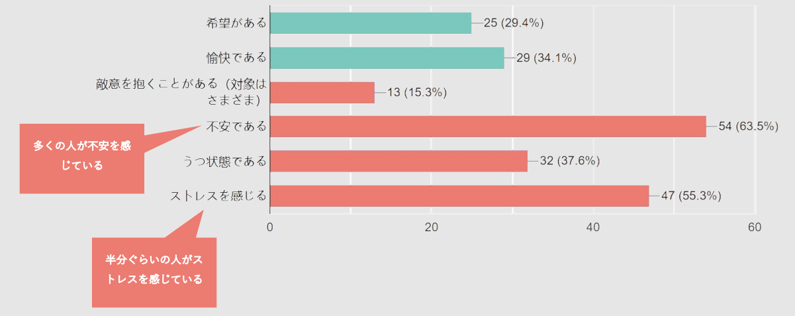
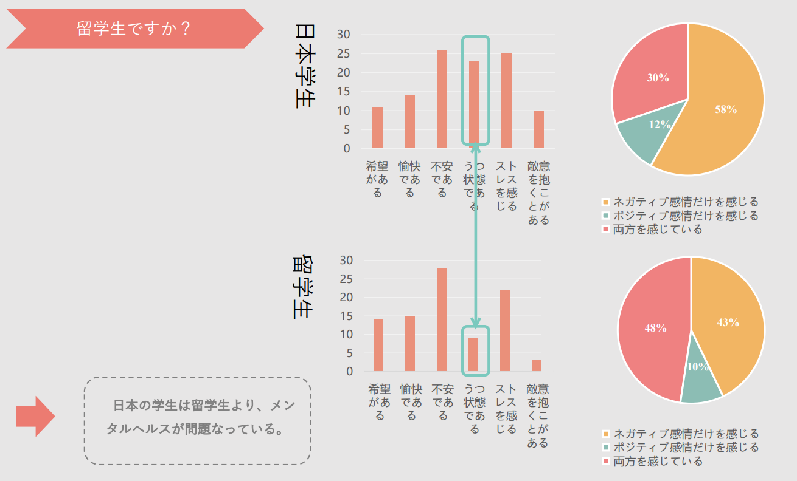

# 前言
我曾经在大学时代开展的一次数据收集和研究。

当时正处于2021年，正是新冠病毒最为严重的时期。在我的生活中，我感到了因为长期在家独自学习和生活上各种不便加上学业上的压力而感到的沮丧情绪。

而同时，在大学的一个课程当中，需要我们自己制作调查表收集数据并进行分析的课。在那时我便想到，除我之外，一定有很多和我类似的因为新冠病毒和学业而感觉到压力的人。

所以，我想，通过这个机会，进行一次调查。调查这种心理健康上的问题是否在大学生当中趋于普遍？其导致的原因是什么？能否找什么解决方案？

以这些想法，我进行了一次调查。


这是当时所使用的调查表：
https://docs.google.com/forms/d/e/1FAIpQLSfosd6c0LrsWwgK0iRiLxZ35UnUFh68tZubCOOrSaLlbPRiKw/viewform?usp=pp_url

而当时的调查结论如下：
URL:TODO

最终我收到了来自本学校的85份数据样本，并在这些样本中获得许多有趣的结论。

而时至今日，重新找到当时的调查数据和课题时，我依旧认为这是一个很有研究价值的课题。

## 本次的目标

所以在这次课题当中，我想重新审视当时所获得的数据，结合来自其他的调查，寻找进一步的答案，并结合之前调查的结果进行分析。

# 开始时的课题
首先，我将说明，在之前的调查中获得的结论，然后我将根据之前的结论，提出进一步研究的课题，如证明之前的结论是否正确、是否具有普遍性，当时所提出的解决方案是否可行等等问题。
1. 在大学生中有超过一半的人感到不安和压力等负面情绪，这说明心理问题在大学生当中普遍存在
     - 所以在本次的调查中，我需要首先证明这一结论的正确性，或者说普遍性：因为之前的结论是基于本校学生的数据得出的。
     1. 造成学生们出现心理健康出现问题，感受到压力的原因是什么？
1. 在精神健康上，如果产生了自杀倾向，就可以说明精神健康具有较大的问题。而在之前的调查中，我观察得到，当在生活中是否感知到了愉快和希望，直接影响了一个人是否处于うつ状態，并且决定了一个人是否有自杀倾向——在生活中感受到了愉快和希望的人相比没有感受到的人更少的处于うつ状態并且没有自杀倾向。
    - 首先直观感受上，这是一个非常合理的解释，如果在本次的调查中，如果能找到相关的佐证，我想对这个结论做出更有力量的证明。
1. 留学生相比于日本学生，更少的人处于うつ状態，日本学生的精神健康问题更为严重。
    - 在过去的调查中，并没有找到具体的原因，在我的猜测中，这是由于日本学生更加收到日本的某种文化的影响导致的结果的具体，如果可以在本次研究中想要找到答案。
1. 去心理诊所带给个人主观上的治疗感受比想象中要弱
1. 运动对于其他的心理问题并没有产生太大的影响，但是明显的对在生活中感受到的敌意起到了降低的效果


# 入手数据
通过kaggle获得了以下相关的调查数据——

1. [Student stress factors](https://www.kaggle.com/datasets/samyakb/student-stress-factors?resource=download)
[.csv](<CsvFiles/Student Stress Factors.csv>) ($n=520$) 

2. [Student Stress Factors: A Comprehensive Analysis](https://www.kaggle.com/datasets/rxnach/student-stress-factors-a-comprehensive-analysis)
[.csv](<CsvFiles/StressLevelDataset.csv>) ($n=1100$) 

3. [Student Attitude and Behavior](https://www.kaggle.com/datasets/susanta21/student-attitude-and-behavior)
[.csv](<CsvFiles\Student Attitude and Behavior.csv>) ($n=235$) 

4. [What Makes a University Student Life "Ideal" ?](https://www.kaggle.com/datasets/shivamb/ideal-student-life-survey)\
[Main Questions Answers(.csv)](CsvFiles/survey_responses.csv)\
[Sub Questions Answers(.csv)](CsvFiles/survey_questions_meta.csv)\
($n=2958$)

6. [Factors_ affecting_ university_student_grades](https://www.kaggle.com/datasets/atifmasih/factors-affecting-university-student-grades)
[.csv](<CsvFiles/Factors_ affecting_ university_student_grades_dataset.csv>) ($n=10064$)

## 可用性判断
这些都是乍一看来与本次研究主题相关的调查结构，接着，我想抽出他们具体的调查问卷的内容，以判断他们真的是否适合于本次调查所需的数据。
1. [Student stress factors](https://www.kaggle.com/datasets/samyakb/student-stress-factors?resource=download) [.csv](<CsvFiles/Student Stress Factors.csv>) (0~5评分)
    - 睡眠质量
    - 头痛频率
    - 学业成绩满意度
    - 学习负担的感受以及一周参加课外活动的次数
    - 压力水平感受

2. [Student Stress Factors: A Comprehensive Analysis](https://www.kaggle.com/datasets/rxnach/student-stress-factors-a-comprehensive-analysis)
[.csv](<CsvFiles/StressLevelDataset.csv>)
    1. anxiety_level: 焦虑水平
    2. self_esteem: 自尊
    3. mental_health_history: 心理健康史
    4. depression: 抑郁
    5. headache: 头痛
    6. blood_pressure: 血压
    7. sleep_quality: 睡眠质量
    8. breathing_problem: 呼吸问题
    9. noise_level: 噪音水平
    10. living_conditions: 居住条件
    11. safety: 安全
    12. basic_needs: 基本需求
    13. academic_performance: 学业表现
    14. study_load: 学习负担
    15. teacher_student_relationship: 师生关系
    16. future_career_concerns: 未来职业担忧
    17. social_support: 社会支持
    18. peer_pressure: 同辈压力
    19. extracurricular_activities: 课外活动
    20. bullying: 欺凌
    21. stress_level: 压力水平

3. [Student Attitude and Behavior](https://www.kaggle.com/datasets/susanta21/student-attitude-and-behavior)
[.csv](<CsvFiles\Student Attitude and Behavior.csv>)
    1. Certification Course: 证书课程
    2. Gender: 性别
    3. Department: 系别
    4. Height(CM): 身高（厘米）
    5. Weight(KG): 体重（公斤）
    6. 10th Mark: 初中成绩
    7. 12th Mark: 高中成绩
    8. College Mark: 大学成绩
    9. Hobbies: 爱好
    10. Daily Studying Time: 每日学习时间
    11. Prefer to Study In: 喜欢在哪学习
    12. Salary Expectation: 薪资期望
    13. Do You Like Your Degree?: 喜欢你的学位吗？
    14. Willingness to Pursue a Career Based on Their Degree: 是否愿意从事与学位相关的职业
    15. Social Media & Video: 社交媒体和视频使用情况
    16. Travelling Time: 通勤时间
    17. Stress Level: 压力水平
    18. Financial Status: 财务状况
    19. Part-time Job: 兼职工作
4. [What Makes a University Student Life "Ideal" ?](https://www.kaggle.com/datasets/shivamb/ideal-student-life-survey)
    - **大概**
    1. Career: 职业
    2. Citizenship: 公民身份
    3. Nationality: 国籍
    4. Year since Matriculation: 入学年份
    5. Year of Study: 学习年级
    6. Primary Programme: 主修课程
    7. Gender: 性别 
    8. Department: 系别
    9. Housing Type: 住房类型
    10. Q1-How many events have you Volunteered in?: 你参加了多少次志愿活动？
    11. Q2-How many events have you Participated in?: 你参加了多少次活动？
    12. Q3-How many activities are you Interested in?: 你对多少项活动感兴趣？
    13. Q4-How many activities are you Passionate about?: 你对多少项活动充满热情？
    14. Q5-What are your levels of stress?: 你的压力水平是怎样的？
    15. Q6-How Satisfied You are with your Student Life?: 你对你的学生生活有多满意？
    16. Q7-How much effort do you make to interact with others?: 你在与他人互动方面付出了多少努力？
    17. Q8-About How many events are you aware about?: 你知道多少项活动？
    18. response_id: 回应编号
    19. Q9-What is an ideal student life?: 理想的学生生活是怎样的？
    - 全部
    1. Q1-Volunteered For Animal welfare: 你是否为动物福利志愿服务过。
    2. Q1-Volunteered For Arts/Culture/Heritage: 你是否为艺术、文化或遗产保护志愿服务过。
    3. Q1-Volunteered For Children/Youth: 你是否为儿童或青少年相关活动志愿服务过。
    4. Q1-Volunteered For Community building: 你是否为社区建设相关活动志愿服务过。
    5. Q1-Volunteered For Diversity & Inclusion: 你是否为多样性与包容性相关活动志愿服务过（例如，特殊需要群体、移民工人、跨信仰和跨文化理解等）。
    6. Q1-Volunteered For Environmental sustainability: 你是否为环境可持续发展相关活动志愿服务过。
    7. Q1-Volunteered For Families: 你是否为家庭相关活动志愿服务过。
    8. Q1-Volunteered For Health/Well-being (e.g mental health): 你是否为健康和福祉（如心理健康）相关活动志愿服务过。
    9. Q1-Volunteered For Seniors: 你是否为老年人相关活动志愿服务过。
    10. Q1-Volunteered For Poverty reduction: 你是否为减贫相关活动志愿服务过。
    11. Q1-Volunteered For Education: 你是否为教育相关活动志愿服务过。
    12. Q1-Volunteered For Others: 你是否为其他类型的活动志愿服务过。
    13. Q2-Participated in Societies and Interest Groups: 你是否参与过社团和兴趣小组。
    14. Q2-Participated in Clubs: 你是否参与过俱乐部。
    15. Q2-Participated in Halls, JCRCs and/or Residential College CSCs: 你是否参与过宿舍、学生公寓居民委员会或住宅学院的社区服务中心（CSC）活动。
    16. Q2-Participated in University organised events: 你是否参与过大学组织的活动。
    17. Q2-Participated in Others: 你是否参与过其他类型的活动。
    18. Q3-Interested in Arts & Culture: 你是否对艺术和文化感兴趣。
    19. Q3-Interested in Science & Technology: 你是否对科学和技术感兴趣。
    20. Q3-Interested in Research and independent study: 你是否对研究和独立学习感兴趣。
    21. Q3-Interested in Sports: 你是否对体育活动感兴趣。
    22. Q3-Interested in Other competitions (eg case, debates): 你是否对其他类型的比赛（例如案例分析、辩论赛）感兴趣。
    23. Q3-Interested in Entrepreneurship: 你是否对创业感兴趣。
    24. Q3-Interested in Volunteering: 你是否对志愿服务感兴趣。
    25. Q3-Interested in Others: 你是否对其他领域感兴趣。
    26. Q4-Passionate about Animal welfare: 你是否对动物福利充满热情。
    27. Q4-Passionate about Arts/Culture/Heritage: 你是否对艺术、文化或遗产保护充满热情。
    28. Q4-Passionate about Children/Youth: 你是否对儿童或青少年相关活动充满热情。
    29. Q4-Passionate about Community building: 你是否对社区建设相关活动充满热情。
    30. Q4-Passionate about Diversity & Inclusion: 你是否对多样性与包容性相关活动充满热情（例如，特殊需要群体、移民工人、跨信仰和跨文化理解等）。
    31. Q4-Passionate about Environmental sustainability: 你是否对环境可持续发展相关活动充满热情。
    32. Q4-Passionate about Families: 你是否对家庭相关活动充满热情。
    33. Q4-Passionate about Health/Well-being (e.g mental health): 你是否对健康和福祉（如心理健康）相关活动充满热情。
    34. Q4-Passionate about Seniors: 你是否对老年人相关活动充满热情。
    35. Q4-Passionate about Poverty reduction: 你是否对减贫相关活动充满热情。
    36. Q4-Passionate about Education: 你是否对教育相关活动充满热情。
    37. Q4-Passionate about None of the above: 你是否对上述提到的任何一个领域都没有热情。
    38. Q4-Passionate about Others: 你是否对其他领域充满热情。
    39. Q5-Stressed about Adjustment issues: 你是否因调整问题感到压力。
    40. Q5-Stressed about Academic issues: 你是否因学业问题感到压力。
    41. Q5-Stressed about Financial issues: 你是否因财务问题感到压力。
    42. Q5-Stressed about Family issues: 你是否因家庭问题感到压力。
    43. Q5-Stressed about Friendships: 你是否因友谊问题感到压力。
    44. Q5-Stressed about Romantic relationships: 你是否因恋爱关系感到压力。
    45. Q5-Stressed about Health related issues: 你是否因健康问题感到压力。
    46. Q5-Stressed about Career related issues: 你是否因职业相关问题感到压力。
    47. Q5-Stressed about My involvement in hostel, clubs, societies, interest groups, etc.: 你是否因参与宿舍活动、俱乐部、社团和兴趣小组等感到压力。
    48. Q5-Stressed about Others: 你是否因其他问题感到压力。
    49. response_id: 你的回答的唯一标识符。
6. [Factors_ affecting_ university_student_grades](https://www.kaggle.com/datasets/atifmasih/factors-affecting-university-student-grades)
[.csv](<CsvFiles/Factors_ affecting_ university_student_grades_dataset.csv>)
    1. Age: 你的年龄。
    2. Gender: 你的性别（例如，男性、女性、非二元等）。
    3. Parental_Education: 父母的教育水平或学历。
    4. Family_Income: 你的家庭收入水平。
    5. Previous_Grades: 你以前取得的成绩。
    6. Attendance: 你的出勤率。
    7. Class_Participation: 你在课堂上的参与度。
    8. Study_Hours: 你每天或每周用于学习的时间。
    9. Major: 你所攻读的主修专业。
    10. School_Type: 你就读的学校类型（例如，公立学校、私立学校、国际学校等）。
    11. Financial_Status: 你的经济状况（例如，家庭收入水平、自身财务状况等）。
    12. Parental_Involvement: 父母对你的学习和学业的参与度。
    13. Educational_Resources: 你可以获得的教育资源，例如图书馆、在线课程等。
    14. Motivation: 你对学习和学业的动机和兴趣。
    15. Self_Esteem: 你的自尊水平和自信心。
    16. Stress_Levels: 你的压力水平（可以是自我评估的低、中、高等）。
    17. School_Environment: 你所在学校的整体学习环境和氛围。
    18. Professor_Quality: 你所接触的教授或教师的教学质量。
    19. Class_Size: 你所在班级的学生人数。
    20. Extracurricular_Activities: 你参与的课外活动，例如社团、志愿者工作等。
    21. Sleep_Patterns: 你的睡眠模式，包括睡眠时间和质量。
    22. Nutrition: 你的营养摄入情况。
    23. Physical_Activity: 你每天或每周进行的体育活动量。
    24. Screen_Time: 你每天花在电子屏幕前的时间，包括手机、电脑、电视等。
    25. Educational_Tech_Use: 你对教育技术和在线学习工具的使用情况。
    26. Peer_Group: 你的同伴群体及其对你的影响。
    27. Bullying: 你是否遇到过欺凌或霸凌现象。
    28. Study_Space: 你用于学习的空间和环境。
    29. Learning_Style: 你的学习风格，例如视觉型、听觉型、动觉型等。
    30. Tutoring: 你是否接受过辅导或补习。
    31. Mentoring: 你是否有指导老师或导师。
    32. Lack_of_Interest: 你对学习或某些学科是否缺乏兴趣。
    33. Time_Wasted_on_Social_Media: 你每天在社交媒体上浪费的时间。
    34. Sports_Participation: 你是否参与或已经参与体育活动或比赛。
    35. Grades: 你当前的成绩。
# 根据课题选取
## 在大学生中有超过一半的人感到不安和压力等负面情绪，这说明心理问题在大学生当中普遍存在的问题是否在世界范围普遍存在？
我尝试让ChatGpt(OpenAI)来帮助我进行选取，这是我的问题和回答
```
分析下列统计数据的单元中哪些项目是和“心理问题在大学生当中普遍存在？”直接相关，并告诉我这些项目的名字
```
在某些情况下，ChatGpt似乎忘记我要求的直接相关的要求，返回一些不需要的项目，我在这时会告诉它：
```
我要的是直接的，最能说明的
```
以纠正它的回答。

而最后对于这个问题，它进行了如下筛选——
1. [Student stress factors](https://www.kaggle.com/datasets/samyakb/student-stress-factors?resource=download) [.csv](<CsvFiles/Student Stress Factors.csv>) (0~5评分)
    1. **睡眠质量**：
        - 睡眠质量对心理健康的影响非常直接。差的睡眠质量往往是心理问题如焦虑、抑郁和压力的重要症状和后果。
        

    2. **压力水平感受**：
        - 压力水平感受直接反映了学生的心理压力状态。高压力常与心理问题密切相关，是心理健康状况的重要指标。
        

2. [Student Stress Factors: A Comprehensive Analysis](https://www.kaggle.com/datasets/rxnach/student-stress-factors-a-comprehensive-analysis)
[.csv](<CsvFiles/StressLevelDataset.csv>)
    1. **anxiety_level (焦虑水平)**：
        - 这是直接衡量一个人焦虑程度的指标，焦虑是常见的心理问题之一。
        
        
    2. **depression (抑郁)**：
        - 抑郁是另一个普遍的心理问题，这个指标直接衡量学生的抑郁水平。
        
        
    3. **stress_level (压力水平)**：
        - 压力水平直接反映学生的心理压力状态，高压力水平通常与心理问题密切相关。
        

    4. **mental_health_history (心理健康史)**：
        - 学生过去的心理健康史对评估其当前心理健康状况有重要参考价值。
        
    5. **self_esteem (自尊)**：
        - 自尊水平也是心理健康的重要指标，低自尊常与各种心理问题瓜葛。
        
        
    6. **sleep_quality (睡眠质量)**：
        - 睡眠质量是心理健康的一个重要指示器，差的睡眠质量通常与心理问题如焦虑和抑郁有关。
        
3. [Student Attitude and Behavior](https://www.kaggle.com/datasets/susanta21/student-attitude-and-behavior)
[.csv](<CsvFiles\Student Attitude and Behavior.csv>)
    1. **Stress Level (压力水平)**：
        - 这个指标直接反映学生的心理压力状态，是衡量心理问题（如焦虑、抑郁）最直接的指标之一。
        
    2. **Do You Like Your Degree? (喜欢你的学位吗？)**：
        - 对所学专业的满意度可以直接影响学生的心理状况。如果学生对自己所学的学位感到不满意，往往会带来心理压力和不快。
        
4. [What Makes a University Student Life "Ideal" ?](https://www.kaggle.com/datasets/shivamb/ideal-student-life-survey)
    - **大概**
        1. **Q5-What are your levels of stress? (你的压力水平是怎样的？)**
            - 这个问题直接询问学生的压力水平，可以直接反映出学生是否在承受心理压力。
            
6. [Factors_ affecting_ university_student_grades](https://www.kaggle.com/datasets/atifmasih/factors-affecting-university-student-grades)
[.csv](<CsvFiles/Factors_ affecting_ university_student_grades_dataset.csv>)
    1. **Stress_Levels (压力水平)**：
        - 这个指标直接反映学生的压力水平，是衡量学生心理健康状况的直接指标。高压力水平通常与焦虑和抑郁等心理问题密切相关。
        
    2. **Self_Esteem (自尊水平和自信心)**：
        - 自尊水平和自信心是心理健康的重要方面。低自尊常与抑郁和焦虑等心理问题相关，是心理问题的重要指标。
        
    3. **Sleep_Patterns (睡眠模式，包括睡眠时间和质量)**：
        - 睡眠质量和睡眠时间是心理健康的关键因素。差的睡眠质量和不规律的睡眠模式常与心理问题如焦虑和抑郁相关。
        

另外额外发现，[What Makes a University Student Life "Ideal" ?](https://www.kaggle.com/datasets/shivamb/ideal-student-life-survey)  中具有大量以下类型数据，非常适合分析原因：
    1. **Q5-Stressed about Adjustment issues: 你是否因调整问题感到压力。**
        - 调整问题常常与适应新环境和生活方式相关，这是一个常见的心理压力源。

    3. **Q5-Stressed about Academic issues: 你是否因学业问题感到压力。**
        - 学业压力是大学生心理问题的重要因素之一，与焦虑、抑郁等心理问题密切相关。

    4. **Q5-Stressed about Financial issues: 你是否因财务问题感到压力。**
        - 财务问题能够显著影响学生的心理健康，导致焦虑和抑郁等情绪问题。

    5. **Q5-Stressed about Family issues: 你是否因家庭问题感到压力。**
        - 家庭问题是一个重要的压力源，直接影响学生的心理状态。

    6. **Q5-Stressed about Friendships: 你是否因友谊问题感到压力。**
        - 交友和人际关系问题也是学生心理压力的一个重要方面。

    7. **Q5-Stressed about Romantic relationships: 你是否因恋爱关系感到压力。**
        - 恋爱关系中的冲突和压力可以显著影响学生的心理健康。

    8. **Q5-Stressed about Health related issues: 你是否因健康问题感到压力。**
        - 健康问题，包括心理健康问题，直接反映学生的心理状态。

    9. **Q5-Stressed about Career related issues: 你是否因职业相关问题感到压力。**
### 分析
在这些相关的问题的答案中，去除几个统计数据已经进行了针对性的数据清洗，如[Factors_ affecting_ university_student_grades](https://www.kaggle.com/datasets/atifmasih/factors-affecting-university-student-grades) [.csv](<CsvFiles/Factors_ affecting_ university_student_grades_dataset.csv>)，数据经过了处理，而这两组数据更没有，从以下这几个统计中获得的数据有着更强的说明性

 - [What Makes a University Student Life "Ideal" ?](https://www.kaggle.com/datasets/shivamb/ideal-student-life-survey)
    - **大概**
        1. **Q5-What are your levels of stress? (你的压力水平是怎样的？)**
            - 这个问题直接询问学生的压力水平，可以直接反映出学生是否在承受心理压力。
            

对于该数据，ChatGPT给出了以下分析
>```
># 计算分位数
>quantiles = Q5_data.quantile([0.1, 0.25, 0.5, 0.75, 0.9])
>```
>以下是Q5问题“你感到多大压力？”的分位数分析：
>
>第10百分位（0.10分位）: 1.0\
>10%的学生压力水平在1.0或以下。\
>第25百分位（0.25分位）: 2.0\
>25%的学生压力水平在2.0或以下。\
>第50百分位（0.50分位）/中位数: 3.0\
>50%的学生压力水平在3.0或以下。\
>第75百分位（0.75分位）: 4.0\
>75%的学生压力水平在4.0或以下。\
>第90百分位（0.90分位）: 5.0\
>90%的学生压力水平在5.0或以下\
>这意味着：\
>大多数学生的压力水平集中在2.0到4.0之间。\
>极少数学生（10%）的压力水平较低，只有1.0或更低。\
>同样有一小部分学生（10%）的压力水平较高，在5.0或更高。

根据图表，和来自ChatGpt的分析可知，大多数的学生的压力处于中间范围，并且偏向较低的指数。
- [Student Attitude and Behavior](https://www.kaggle.com/datasets/susanta21/student-attitude-and-behavior)
[.csv](<CsvFiles\Student Attitude and Behavior.csv>)
    1. **Stress Level (压力水平)**：
        - 这个指标直接反映学生的心理压力状态，是衡量心理问题（如焦虑、抑郁）最直接的指标之一。
        \
在这组数据中，我们同样看出，该数据中，可以将描述心理健康有问题的对象为"Awful"和"Bad"两个对象，而无太大的问题的是"Good"和"Fabulous"两个对象，而其中心理健康有问题的比例大概为两者只和的 $37\%$ 左右。


[What Makes a University Student Life "Ideal" ?](https://www.kaggle.com/datasets/shivamb/ideal-student-life-survey)
$$
n_{Singapore}=2467,n_{China}=158,n_{Malaysia}=130,n_{India }=47,n_{Indonesia}=39
$$

从这三个分析可知，总体来看，大学生的心理健康问题趋于健康。

特别是相比于我再之前的统计中通过各种负面情绪的感受所获知的结果——心理健康具有问题的大学生的比例占整体的一半左右这个结论比较来看，明显我所得到的结论中大学生的心理问题远大于这次统计的数据中大学生心理健康状态要更具有问题。

答えた人の中その気持ちを持っている人の数を割合
### 结论
而这我可以对第一个课题得到结论
- **心理问题在大学生当中并非普遍存在，更集中在小部分的大学生上。**

进一步又会获得以下的新的问题（课题）
- 过去的我的调查集中于本学校（デジタルハリウッド大学），对比于本次的结论和之前的结论——**デジタルハリウッド大学 的学生的心理健康状况是不是相比其他大学的学生更加有问题？是什么导致了这样的问题的出现？**
- 过去的调查是在新冠病毒期间进行的调查，当时要求学生进行网课，生活上也有很多的限制。对比两者结论的不同，**导致当时大学生心理健康更加糟糕的原因是否是因为新冠病毒时期的影响？**
## 留学生相比于日本学生，更少的人处于うつ状態，日本学生的精神健康问题更为严重。
本次调查，部分数据来自全球的大学生，还有部分调查的数据并没有名确的标出是来自于哪个地区的大学生，因为这样的数据特点上，我认为很难得出准确的答案。

但说回数据分析，在本次的分析当中，并没有发现大学生的压力普遍较高，整体甚至趋于偏低的水品。如果只比较本次分析的结论，即 “**心理问题在大学生当中并非普遍存在，更集中在小部分的大学生上。**”这一结论和本人上次在`デジタルハリウッド大学`进行的调查中得到的 “**超过50%的学生都在大学生活中感受到了压力**”这两个结论，是可以推测为——
- 日本的大学生相比全世界的大学生来看，日本的大学生在心理健康上更成问题。

而另外，在`デジタルハリウッド大学`进行的调查中，我进行了留学生和日本大学生的心理健康的直接对比，在那次对比之下更得出了更名确的佐证。


但是，在其他的调查当中，如该调查（
https://www.jstage.jst.go.jp/article/pacjpa/71/0/71_1EV050/_pdf/-char/ja
）
的结论当中说明，中国的大学生的压力表现大于日本的大学生，而抑うつ表现上，日本的大学生在调查结果上又大于中国大学生。

## 结合前两者的结论
在本次的收集数据和其他人的调查过程中，我获得了各种不同的关于“压力”、“抑うつ”、等方面的统计数据。在这些统计数据和结论当中，部分数据上日本大学生的数值更高（说明这些情绪日本大学生更普遍的感受到），部分数据上日本大学生的数值又较低。

从获得种种不同的结论上，就算在前次本人的调查结论下，并有本次的调查结论的对比，我认为也很难在结论中说“日本大学生的心理健康相比全世界的大学生来说更成问题。”

且在另一方面，在进行了这些调查后，我趋向于认为，大学生整体人群的心理问题非常难以评价。

比如说，首先，获得的关于大学生的关于自我压力的评价是自我评价，我认为这样的自我评价并不能足够客观的进行日本与世界的大学生的心理健康的对比。另外，从数据上，如何判断大学生整体的心理健康是好还是坏？当数据超过一个阈值（比如50%）算有问题，当低于这个阈值可以说没问题？

所以说，面对这个课题，如果单去解决它，我需要更多更有针对性的调查才能知道这个问题的答案，在本次的调查中，很难再进行进一步的调查，故我打算不再对于该问题进行更深一步的讨论。
## 压力来源
1. [Student stress factors](https://www.kaggle.com/datasets/samyakb/student-stress-factors?resource=download)
[.csv](<CsvFiles/Student Stress Factors.csv>) ($n=520$) 

2. [Student Stress Factors: A Comprehensive Analysis](https://www.kaggle.com/datasets/rxnach/student-stress-factors-a-comprehensive-analysis)
[.csv](<CsvFiles/StressLevelDataset.csv>) ($n=1100$) 


3. [Student Attitude and Behavior](https://www.kaggle.com/datasets/susanta21/student-attitude-and-behavior)
[.csv](<CsvFiles\Student Attitude and Behavior.csv>) ($n=235$) 
```python
selected_df['Gender'].replace({'Male': 1, 'Female': 0}, inplace=True)
selected_df['Do you like your degree?'].replace({'Yes': 1, 'No': 0}, inplace=True)
selected_df['part-time job'].replace({'Yes': 1, 'No': 0}, inplace=True)
selected_df['Stress Level '].replace({'Bad':2, 'Awful':3, 'Good':1, 'fabulous':0}, inplace=True)
selected_df['Financial Status'].replace({'Bad':1, 'Awful':0, 'good':2, 'Fabulous':3}, inplace=True)
selected_df['Certification Course'].replace({'Yes': 1, 'No': 0}, inplace=True)
selected_df['social medai & video'].replace({'1.30 - 2 hour':2, '1 - 1.30 hour':1.5, 'More than 2 hour':2.5, '30 - 60 Minute':1,
 '1 - 30 Minute':0.5, '0 Minute':0}, inplace=True)
selected_df['Travelling Time '].replace({'30 - 60 minutes':1, '0 - 30 minutes':0.5, '1 - 1.30 hour':1.5, '2 - 2.30 hour':2.5,
 '1.30 - 2 hour':2, 'more than 3 hour':3.5, '2.30 - 3 hour':3}, inplace=True)
selected_df['willingness to pursue a career based on their degree  '].replace({'50%':0.5, '75%':0.75, '25%':0.25, '100%':1, '0%':0}, inplace=True)
selected_df['daily studing time'].replace({'0 - 30 minute':0, '30 - 60 minute':1, '1 - 2 Hour':2, '2 - 3 hour':3, '3 - 4 hour':4, 'More Than 4 hour':4.5}, inplace=True)
df_dummies = pd.get_dummies(selected_df, columns=['Department'], drop_first=True)
df_dummies = pd.get_dummies(df_dummies, columns=['hobbies'], drop_first=True)
df_dummies = pd.get_dummies(df_dummies, columns=['prefer to study in'], drop_first=True)
selected_df = df_dummies
```


4. [What Makes a University Student Life "Ideal" ?](https://www.kaggle.com/datasets/shivamb/ideal-student-life-survey)\
[Main Questions Answers(.csv)](CsvFiles/survey_responses.csv)\
[Sub Questions Answers(.csv)](CsvFiles/survey_questions_meta.csv)\
($n=2958$)


6. [Factors_ affecting_ university_student_grades](https://www.kaggle.com/datasets/atifmasih/factors-affecting-university-student-grades)
[.csv](<CsvFiles/Factors_ affecting_ university_student_grades_dataset.csv>) ($n=10064$) 
 